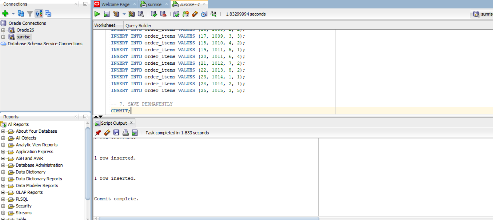
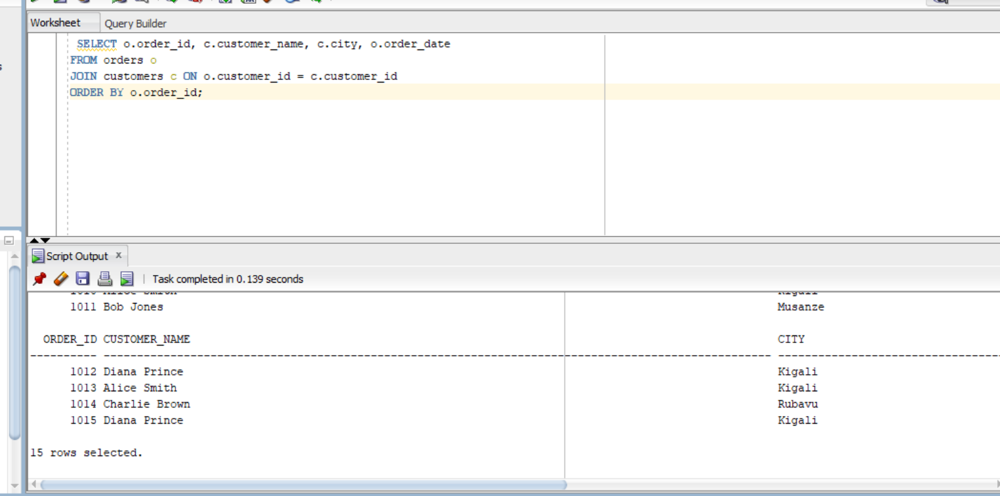
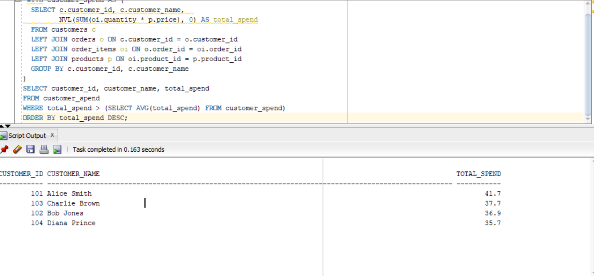
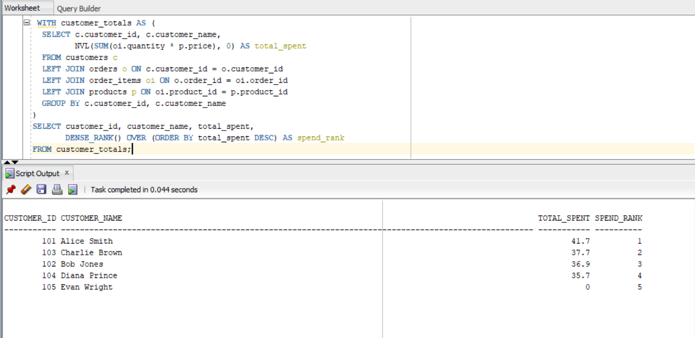
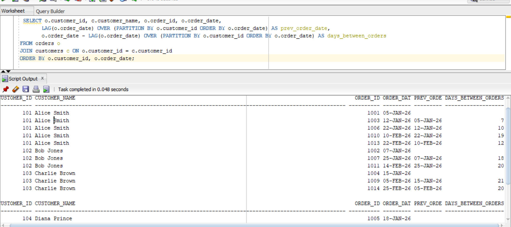

# Database Systems Assignment 1: E-Commerce / Supermarket Analytics

**Student Name:** IRIHO ODILE  
**Student ID:** 28965  
**Course:** PL/ SQL  
 Oracle Database / SQL Developer  

---

## 1. Project Overview

This repository contains the database schema, sample dataset, and analytical queries for an E-Commerce / Supermarket Data Management System (**Sunrise Supermarket**).

The database tracks key transactional entity relationships across four main tables:
- **Customers**: Primary details and locations of registered buyers.
- **Products**: Merchandise categories and pricing structure.
- **Orders**: Header records capturing transactional dates and customer mappings.
- **Order Items**: Line-item quantities associated with specific orders and products.

---

## 2. Relational Database Schema & Data

The core database design is implemented using Relational Integrity Constraints (Primary Keys and Foreign Keys).

- `customers` (customer_id PK, customer_name, email, city)
- `products` (product_id PK, product_name, category, price)
- `orders` (order_id PK, customer_id FK -> customers, order_date)
- `order_items` (order_item_id PK, order_id FK -> orders, product_id FK -> products, quantity)

The script populating 5 customers, 8 products across multiple categories, 15 orders, and 25 order items is included in [`schema.sql`](./schema.sql).

---

## 3. Analytical Queries & Implementation Summary

The project includes 8 complex analytical queries saved in [`queries.sql`](./queries.sql) utilizing SQL joins, aggregation, Common Table Expressions (CTEs), and window functions:

1. **INNER JOIN**: Evaluates customer orders with corresponding customer location details.
2. **Multi-Table JOIN**: Combines order line items with product names and pricing calculations.
3. **LEFT JOIN**: Identifies active order history and detects customers with zero orders.
4. **Common Table Expression (CTE)**: Filters customers whose total expenditure exceeds the overall customer average.
5. **DENSE_RANK() Window Function**: Ranks total customer expenditure without gaps in rank sequence.
6. **ROW_NUMBER() Window Function**: Generates chronological sequence numbers per customer's purchase history.
7. **SUM() OVER() Window Function**: Computes running cumulative revenue totals ordered by transaction dates.
8. **LAG() Window Function**: Calculates intervals and elapsed days between sequential orders for individual customers.

---

## 4. Query Execution Outputs & Screenshots

### Screenshot 1: Database Setup and Population


### Screenshot 2: Multi-Table JOIN Analysis


### Screenshot 3: High-Spender CTE Calculation


### Screenshot 4: Customer Ranking Window Function


### Screenshot 5: Order Interval Analysis (LAG Function)


---

## 5. Challenges and Resolutions

During the design, implementation, and execution phases of this database system, several technical challenges were encountered and successfully resolved:

1. **Challenge: Uncommitted Transactions and Missing Data in Query Results**
   - *Problem:* After executing `INSERT` statements in Oracle SQL Developer, querying the tables in subsequent sessions returned empty results or failed to show updated rows.
   - *Resolution:* Oracle RDBMS requires explicit transaction management. Added an explicit `COMMIT;` statement at the end of the `schema.sql` script and utilized script execution (`F5`) to ensure all records were permanently written to the database disk.

2. **Challenge: Referential Integrity Foreign Key Violations During Dropping/Recreating Tables**
   - *Problem:* Running table creation scripts repeatedly threw ORA errors because child tables (`order_items`, `orders`) held active foreign key references to parent tables (`products`, `customers`).
   - *Resolution:* Included `CASCADE CONSTRAINTS` in all `DROP TABLE` statements (e.g., `DROP TABLE customers CASCADE CONSTRAINTS;`), allowing tables to be dropped and rebuilt cleanly in any sequence without constraint conflicts.

3. **Challenge: Handling Date Formatting in Oracle SQL**
   - *Problem:* Inserting dates as plain text strings resulted in literal type mismatches or dependent implicit formatting errors based on regional system settings.
   - *Resolution:* Standardized all date insertions using Oracle's explicit conversion function `TO_DATE('YYYY-MM-DD', 'YYYY-MM-DD')`, ensuring cross-platform date consistency.

4. **Challenge: Calculating Order Time Intervals for First-Time Orders**
   - *Problem:* Applying the `LAG()` window function to calculate days between orders produced `NULL` values for a customer's initial order, leading to potential display issues in reporting.
   - *Resolution:* Utilized standard SQL handling where `NULL` accurately reflects the absence of a prior reference date for new customers, while confirming that subsequent orders accurately return the day offset integer.

---
## 6. Repository File Structure

Below is the complete file directory layout for this repository:

```text
assignment_1_your_name-your_id/
│
├── schema.sql           # Complete Table DDL creation scripts and INSERT statements
├── queries.sql          # All 8 Analytical SQL Queries (Joins, CTEs, Window Functions)
├── README.md            # Final Assignment Documentation, Technical Summary, & Screenshots
└── screenshots/         # Directory containing all query result screenshot images
    ├── 1.png
    ├── 2.png
    ├── 3.png
    ├── 4.png
    └── 5.png
